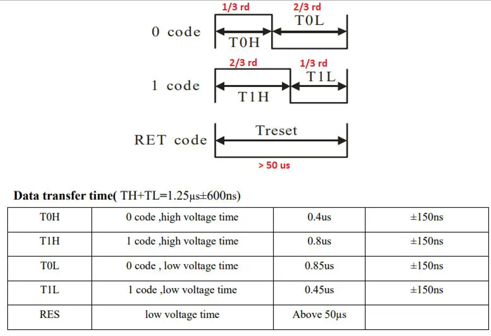

# Project Overview

This project drives a LED matrix with WS2812B addressable LEDs. The LED matrix was used as a vehicle rear brake light.

The driver is implemented by `ws2812b_driver.c`, which uses the STM32 HAL Library to control WS2812B LEDs, utilizing PWM signals with
varying duty cycles adjusted via DMA transfers.

Low-level drivers:

- `set_led_by_rgb` modifies in memory a global array `custom` that stores the color of leds.
- `send_led_data` sends a led data array to the physical Led matrix.

Other functions:

- `show_husky_animation` displays an animation of stored bitmaps representing a Husky in a non-blocking way.
- `show_blinking_animation` makes the matrix blinks in a certain color with certain frequency.

This has been tested in a STM32G4 Nucleo Development Board. This project uses stm32-for-vscode extension in VSCode.

# Usage Examples

Animation functions follows this interface (Video showcase https://youtu.be/G15Shj-zHJg)

```C
// Start the led matrix with a husky logo for 2 seconds.
uint32_t current_time = HAL_GetTick();
uint32_t end_time = current_time + 2000;
uint32_t animation_start_time = current_time;
while (current_time < end_time) {
    show_husky_animation(animation_start_time, BRIGHTNESS);
    current_time = HAL_GetTick();
}
```

Settings the first three leds to some colors and send data

```C
set_led_by_code(0, COLOR_YELLOW);
set_led_by_code(1, COLOR_BRIGHT_PURPLE);
set_led_by_rgb(2, 255, 0, 0); // Red
send_led_data(custom_led_data, ADC_MAX_VALUE) // Send max brightness
```

# Technical Notes

## WS2812B Addresable LED protocol



- Transfer rate is `800 kHz`, or `1.25us` period cycle for each bit
- Each led is `24` bits in GRB format.
- Need to send `NUM_LEDS` \* `24` bits together, with GRB format and MSB first, then the `reset` code to signal the end of the data transmission. The first 24 bits sent will be for the first led, and so on.

  If not clear see https://gist.github.com/v0idv0id/3f37bdca09288e138a71b212957df954

- Bit `1` is DC 66.6% and Bit `0` is DC 33.3%
- `Reset` code is 40 cycles all low.
- Start with `Reset` before sending any led data. (Recommended, but I will try without doing this)
- Only need to send once the led data for an image. The led matrix will retain that image until you send a new led data.

## How driver works

The driver uses DMA + PWM approach (which offloads this task of bit-banging the GPIO from the CPU) to drive the led array.

We have an array of N leds, so a data frame (corresponding to an image in the led matrix) is $N \times 24$ bits.

The led matrix DIN pin is connected to the uC TIM1_CH1 (PA8 pin), which is a PWM signal.

Each bit is a PWM cycle with a specific DC. The DC value is changed through the Compare/Capture register TIM1_CCR1 (which is 16-bit wide). Therefore, each bit can be represented as a 16-bit half-word to represent DC.

Timer 1 is configured such that channel 1 outputs a PWM signal and DMA request line TIM1_CC1 is enabled. This DMA request line is triggered when an edge transition happen(when timer match CCR1 value, so PWM signal switches voltage), so DMA peripheral will load a new value for TIM1_CCR1 (change duty cycle) in preparation for the next bit.

To transfer a data frame, there are two approaches using DMA+PWM, the second approach is obviously better, but I am using the first approach for simplicity:

1.  Allocate an array (denoted as PWM_DC_buffer) as $N \times 24$ half-words size, and tell DMA to initiate a single transfer of this size from this array in memory to TIM1_CCR1 register.

    This consumes a huge amount of space, but offloads completely the CPU (only gets interrupted to do work when the transfer is completed).

2.  Allocate a PWM_DC_buffer of much smaller size like $2 \times 24$ half-words wide. A single transfer of DMA will only complete two leds worth of data, so we need N/2 transfers of DMA.

    This consumes a constant amount of space, but requires intervention of CPU to change the DMA Buffer to the next 2 leds's data when half-transfer (HT) and transfer-complete (TC) DMA interrupts happen. See [3] for more details.

## Custom 8x8 Led data

I used the tool mentioned in this video to draw any 8x8 art: https://www.youtube.com/watch?v=Q1iVtLQOZOI \
Convert it into uint8_t[64][3] with Utility/print_img_format.c

# References

[1]https://controllerstech.com/interface-ws2812-with-stm32/

[2]https://cdn-shop.adafruit.com/datasheets/WS2812B.pdf

[3]https://stm32f4-discovery.net/2018/06/tutorial-control-ws2812b-leds-stm32/

[4]https://github.com/MaJerle/stm32-ws2811-ws2812-ws2812b-ws281x-tim-pwm-dma-timer?tab=readme-ov-file
